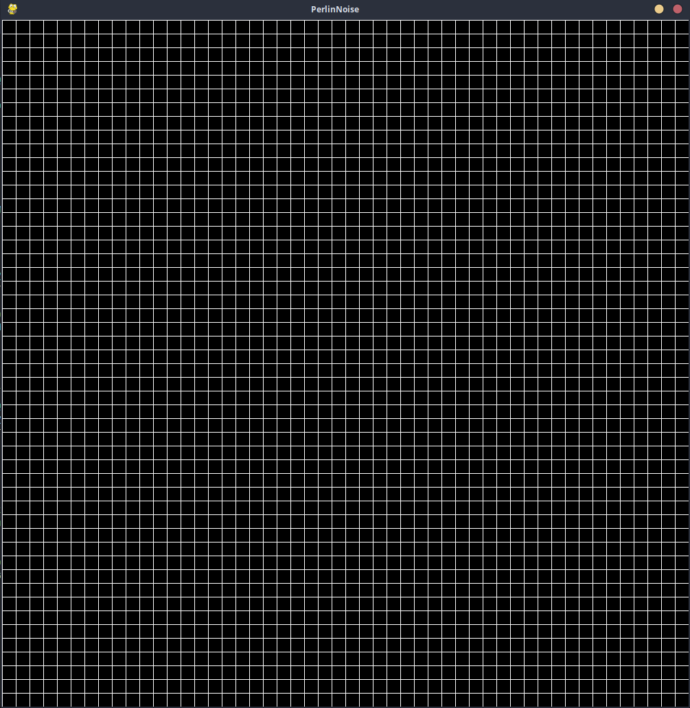
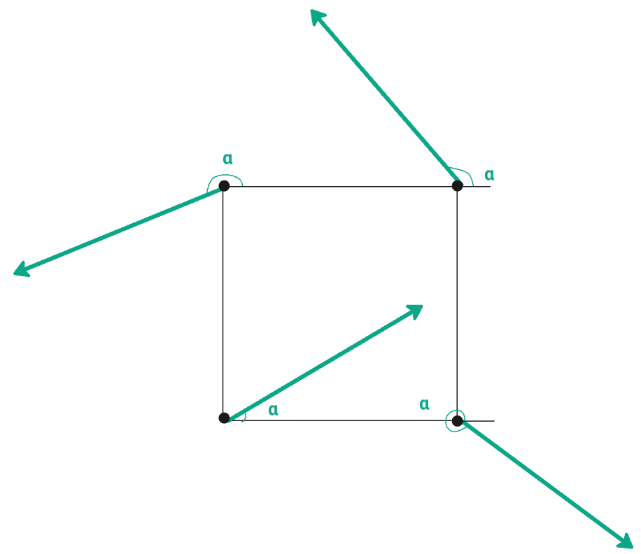
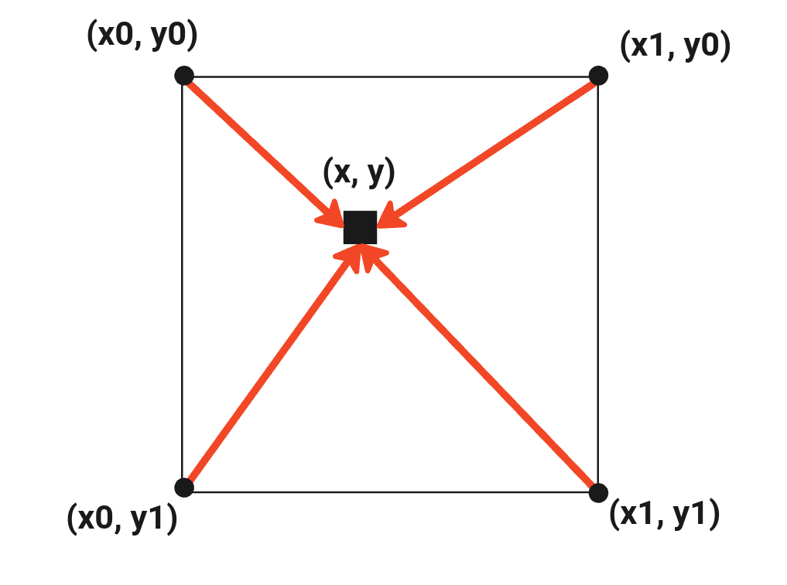
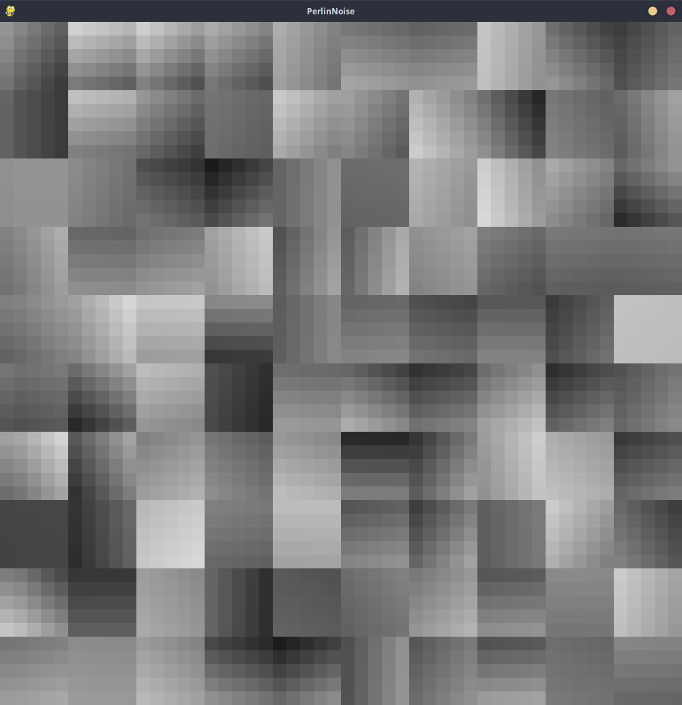
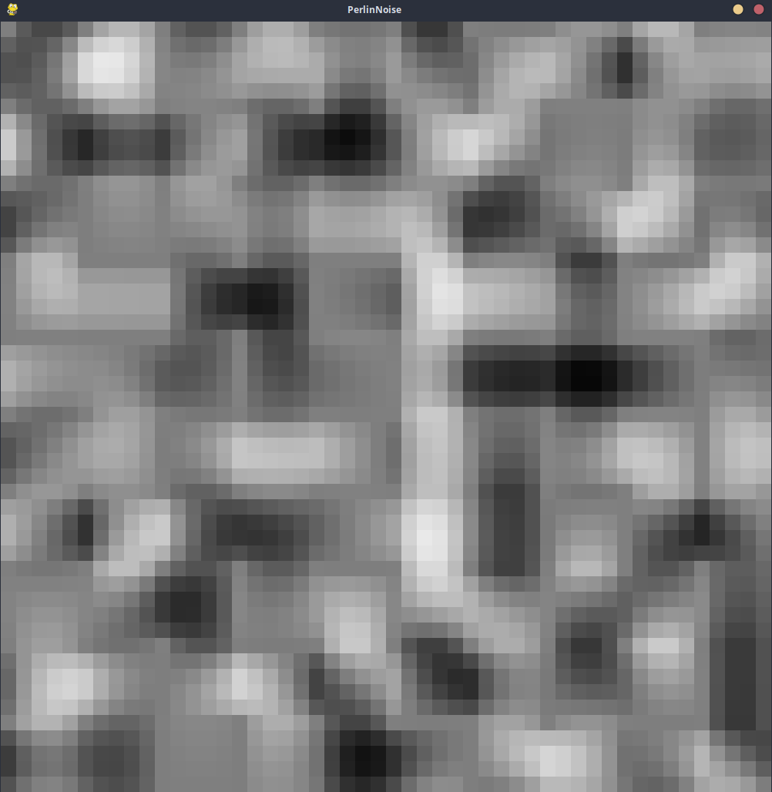
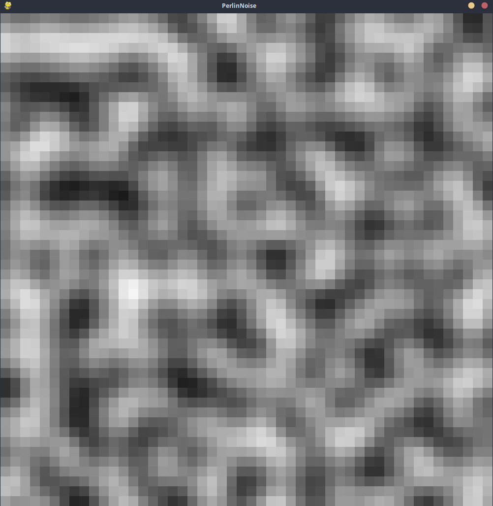

# Projeto

O projeto consiste na implementação do algoritmo do ruido de Perlin utilizando o Pygame. Esse algoritmo é gera ruído com com transição suave, e tem muitas aplicações em computação gráfica.

# Bibliotecas utilizadas

- Pygame 2.6.1

# Explicação do algoritmo

## 1) Montar o grid

Dado um tamanho de em WIDTH e HEIGHT e um tamanho de PIXEL. A janela será separada em uma grade de WIDTH / PIXEL or HEIGHT / PIXEL.

Cada quadrado do grid será considerado um pixel do ruído.  

## 2) Vetores gradiente e vetores de distância

Para cada quadrado do grid, será gerado um vetor de ângulo aleatório (em radianos) de módulo 1 para seus vértices (os ângulos estão salvos em uma matriz). Esses vetores serão chamados de vetores gradiente.

Cada quadrado do grid também tem um ponto associado. Esse ponto é calculado pela coordenada do pixel $(x,y)$ dividido pela escala qual se quer o algoritmo, enquanto os vértices serão a combinação do piso desses valores ($x_0 = \lfloor x \rfloor$ e $y_0 = \lfloor y \rfloor$) com o piso desses valores mais um ($x_1 = x_0 + 1$ e $y_1 = y0+1$).

À partir desses pontos são calculados o vetor de distância.

Considere, por enquanto, esses vetores como

$$ \vec{vg_0} = cos(\alpha_0\times \pi) $$
$$ \vec{vg_1} = cos(\alpha_1\times \pi) $$
$$ \vec{vg_2} = cos(\alpha_2\times \pi) $$
$$ \vec{vg_3} = cos(\alpha_3\times \pi) $$

## 3) Produto escalar

Agora é necessário calcular o produto escalar entre os vetores gradiente e vetores distância em cada vértice do produto escalar.

Seja  

$$ \vec{vd_0} = (x_0, y_0) $$
$$ \vec{vd_1} = (x_0, y_1) $$
$$ \vec{vd_2} = (x_1, y_0) $$
$$ \vec{vd_3} = (x_1, y_1) $$

então

$$ d_{00} = <\vec{vg_0},\vec{vd_0}> $$
$$ d_{01} = <\vec{vg_1},\vec{vd_1}> $$
$$ d_{10} = <\vec{vg_2},\vec{vd_2}> $$
$$ d_{11} = <\vec{vg_3},\vec{vd_3}> $$

Considere, inicialmente, a média desses valores escalares como o valor em cada pixel do ruído. Mas, antes de mostrar o resultado, precisa-se transformar o valor obtido na média para o valor da escala de cinza.

$$ c = \frac{m+v}{M-m} \times 255 $$

Onde $m$ é o menor valor possível, $M$ é o maior valor possível e $v$ é o valor obtido na função. No caso, esses valores vão sempre variar entre -1 ($m$) e 1 ($M$).

Assim, no final a cor obtida na escala rgb é ($c$, $c$, $c$).

## 4) Interpolação linear

Esses valores ainda estão muito diferentes do resultado que esperado pois a transição entre os blocos do grid estão pouco suaves. Portanto, é necessário interpolar os valores obtidos pelo produto vetorial dos vetores de forma que a interpolação suavize as transições entre os pixels.

Para interpolar será usado uma função de interpolação chamada *Lerp*, que funciona da seguinte forma: $a$ é o menor valor e $b$ é o maior valor, $t$ é um valor entre 0 e 1. A função pega um valor entre $a$ e $b$ que vai ser definido por $t$.

$$ l(a,b,t) = a + t \times (b - a) $$

Dessa vez o resultado vai variar entre $-0.\overline 6$ e $0.\overline 6$, o que é importante para calcular a cor.

$$ u = x - x_0 $$
$$ v = y - y_0 $$
$$ nx0 = l(d_{00}, d_{10}, u) $$
$$ nx1 = l(d_{01}, d_{11}, u) $$
$$ res = l(nx_0, nx_1, v) $$

## 5) Amortecimento

O resultado ainda não está suave o suficiente. Para suavizar ainda mais será usada uma função de suavização.

$$ f(t) = 6t⁵-15t⁴+10t³ $$

Essa função será aplicada nos parâmetros da função de interpolação:

$$ u = f(x - x_0) $$
$$ v = f(y - y_0) $$

Gerando o seguinte resultado:

